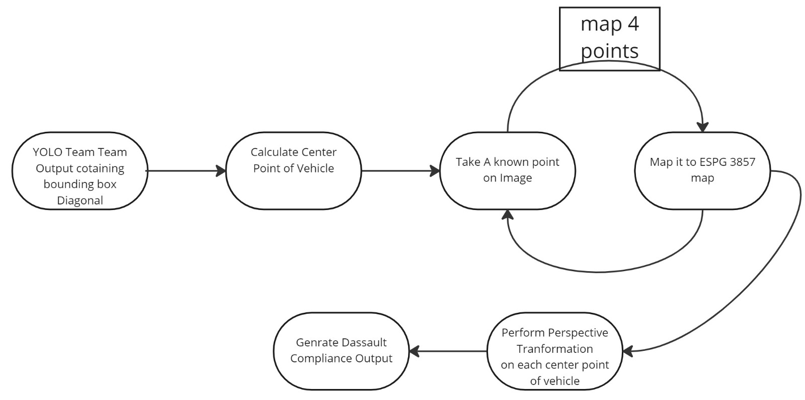
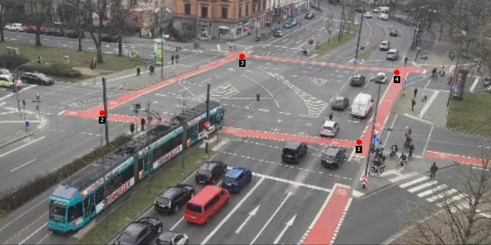
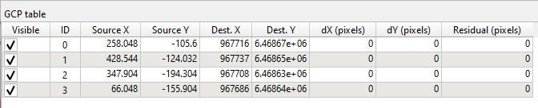
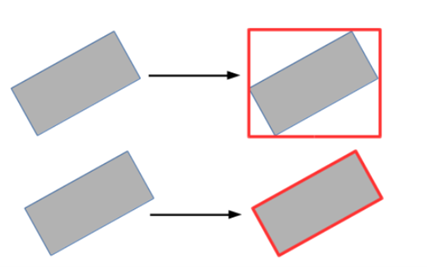
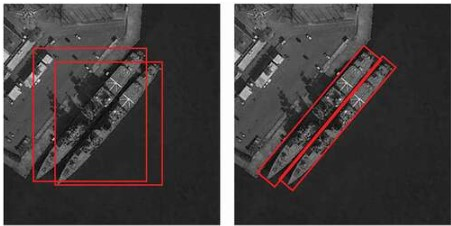
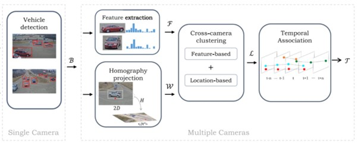

# Transform Coordinates and Multi-track 

[TOC]

## Terminology

- A trajectory: The path that an object follows through space as it moves. In the context of our Digital Twin project, the trajectory refers to the path taken by a car as it moves through its environment. 
- Geospatial data: Information that identifies the geographic location and characteristics of natural or man-made features and boundaries on the Earth's surface. Examples of geospatial data include latitude and longitude 
- Projection: Process of transforming a three-dimensional representation of the Earth's surface into a two-dimensional map. This transformation involves complex mathematical calculations, and as a result, it is impossible to create a projection that accurately represents the entire Earth's surface without any distortions.
- Coordinate System: In geospatial analysis, there are two types of coordinate systems: projected and unprojected. Unprojected coordinate systems, such as longitude and latitude, represent exact locations on the Earth's surface, but performing distance and geospatial data calculations with these coordinates can be difficult. Projected coordinate systems, on the other hand, use a projection to convert the three-dimensional Earth's surface into a two-dimensional plane and plot points on that plane. It is important to know which projection is used for a specific coordinate system in order to work with it properly. 
- Datums: Mathematical model to describe locations on the earth's surface, which consists of reference points that are used to determine the locations of other points. There are many different datums used, but three primary ones are commonly used for larger areas: NAD27, NAD83, WGS84, EPSG 4326 and EPSG 3857.
  - WGS84: Global geodetic datum that provides a reference for determining the location of points on the Earth's surface. Its coverage extends to the entire Earth.
  - EPSG 4326: Coordinate reference system(CRS) based on the WGS84 datum, which uses the longitude and latitude coordinate system to describe a location on the earth's surface. It is commonly used to represent unprojected geographic data and is used by various mapping applications and services.
  - EPSG 3857: Coordinate reference system (CRS) that represents the spherical Mercator projection. It is also known as the web Mercator projection and is used to project the Earth's surface onto a 2D plane.
- GIS (Geographic Information System) and Data Formats: Computer-based system designed to capture, store, manipulate, analyze, and present spatial and geographic data. It is a powerful tool that allows users to visualize, interpret, and understand data in a geographic context. The data can be stored in various formats depending on the type and complexity of the data. Two  of the  most commonly used GIS data formats are: Shapefile and GeoJSON.

 ## Project Pipeline 
 Our project pipeline consists of several key steps for extracting vehicle trajectory information from video data. The image below provides a visual overview of our pipeline process.

 

## Extract Reference Points from Video Data

When converting vehicle bounding boxes from YOLO format (which represents the bounding box coordinates as a fraction of the image size) to pixel coordinates, we need reference points to ensure that the converted bounding boxes are accurate and aligned with the original image. The YOLO format uses normalized coordinates to represent the bounding box location and size relative to the image size. However, when converting these normalized coordinates to pixel coordinates, we need to know the actual image size in pixels and the position of the bounding box relative to a specific reference point in the image.

The reference points in our case are the crossroad borders. By knowing the position of the reference point and the size of the image, we can accurately convert the normalized coordinates to pixel coordinates and obtain the exact location of the bounding box in the original image. 

### Extract Reference Points using QGIS

QGIS is a cross-platform, open-source GIS software that empowers users to manage and analyze geospatial data through various functions such as creation, editing, visualization, and analysis. In our project, we have street videos and screenshots extracted from them, but the files lack coordinates. To obtain the accurate coordinates and position the files in their respective physical locations, we utilize QGIS for geo-referencing. This process involves the incorporation of spatial data or coordinates to a digital image or scanned topographic map. By doing so, the images align precisely with their actual positions in the physical world. 

#### Instructions

To obtain accurate reference points from QGIS, the first step is to capture a screenshot of a frame from the video. However, before extracting the reference points, it is necessary to adjust the resolution of the screenshot to match that of the video.

#### **Setup and Use**
1. Download and install QGIS from the official website, https://www.qgis.org/en/site/forusers/download.html. 
  
When georeferencing maps that lack identifiable points with coordinate values, users must match clearly identifiable points in the map to the corresponding features in a georeferenced map. To achieve this, we employ WMTS (Web Map Tile Service), which is a standardized protocol used to distribute pre-rendered web maps. 

2. To integrate a WMTS (Web Map Tile Service) into QGIS, the following general steps can be taken: 
   - Launch QGIS and create a new project.
   - Navigate to the 'Browser' panel and locate the 'WMS/WMTS'. Right-click and choose 'New connection'.
   - In the connection details, copy and paste the URL 'https://sgx.geodatenzentrum.de/wmts_basemapde/1.0.0/WMTSCapabilities.xml'.
   - From the available WMTS services, select the desired one to use in the project. In our case, 'DE_EPSG_3857_ADV'.

3. Selecting the project coordinate system is an essential step when working with geospatial data in QGIS. It defines the reference system used for your map and is used to interpret and display data accurately. To select the project coordinate system in QGIS, follow these steps: 

    - Click on 'Project' located at the top of the QGIS window and select 'Properties' from the dropdown menu. 
    - In the left-hand column, click on 'CRS' and choose 'WGS 84 / Pseudo-Mercator (EPSG:3857) CRS'.   

4. To commence the georeferencing process, activate the 'Georeferencer' plugin in QGIS by following the instructions below:</
    - Click on 'Plugins' located at the top of the QGIS window.  
    - Choose 'Manage and Install Plugins'. 
    - Locate the 'Georeferencer GDAL' plugin and install it.  

5. To georeference an image in QGIS using the Georeferencer plugin, follow these steps:
    - Open the "Georeferencer" plugin in QGIS. 
    - Click on 'Settings', select 'Transformation Settings' abd choose 'Polynomial3' as the 'Transformation Type'.
    - Click on "Open Raster" and select the image that you want to georeference. 
    - In the Georeferencer window, click on "Add Point" and select a point on the image that you can easily recognize on the WMTS layer.  
    - Click on "From Map Canvas" and select the corresponding point on the WMTS layer. 
    - Repeat this process for four points.  

The image below shows our four reference points.

 
 
A GCP(Ground Control Points) table similar to the one shown below will be generated.

 

6. After you have added your reference points and completed the georeferencing process, you can export them as a file that can be imported into your software for future use. To export the reference points, select 'Export GCP points'. 

#### **Errors and Inaccuracies**

Polynomial transformation is a mathematical technique used to minimize the distortion that can occur when projecting a 3D curved surface onto a 2D flat surface. This transformation helps to minimize the distortion that can occur when projecting a curved surface onto a flat surface, which can result in stretching, shearing, or other forms of distortion.

However, when using QGIS to extract reference points, it is important to choose the appropriate transformation method to achieve accurate results. We found out that our results were inaccurate when using the polynomial transformation, because the code was implementing linear transformation. Perspective projection was preferred over linear transformation, as it was deemed to have a higher chance of producing more accurate results.

By using perspective projection in your code, you can achieve more accurate results when transforming your data. When selecting reference points for transformation, you should observe the accuracy of the results in the GCP table. QGIS allows you to observe the accuracy during the process of selecting reference points, so you can choose additional reference points if necessary or apply a more complex transformation method to achieve better results. If you find that the error value is high, it may indicate that the chosen reference points are not sufficient for accurate transformation. In this case, you can choose additional points or apply a more complex transformation method to improve accuracy.

 

## Future Improvements

### Camera calibration 
Camera calibration is an important step in traffic surveillance systems as it ensures that the captured images and videos have the correct geometric properties and accurate spatial information. This is crucial for the correct calculation of coordinates and trajectories of vehicles and other objects in the scene. The calibration process involves determining the intrinsic and extrinsic parameters of the camera such as focal length, principal point, lens distortion, and the orientation and position of the camera in the real world. 
The use of an iPhone for capturing videos might not necessarily be the best option, as the quality of the captured images and the accuracy of the camera parameters (such as focal length, principal point, etc.) are important factors in the calibration process. To improve the camera calibration in such a project, one could consider either calibrating the iPhone camera or using higher quality cameras with better calibration parameters, or calibrating the iPhone camera specifically for the task at hand by using additional information about the camera and the scene. Additionally, implementing advanced algorithms for camera calibration and tracking can also lead to improved accuracy in the mapping of the captured videos to the real-world coordinates.

In our case, an iPhone camera can be calibrated through a process called intrinsic calibration. This involves determining the intrinsic parameters of the camera such as the focal length, principal point, and distortion coefficients. This information can be obtained using a calibration rig with a known geometry, where a series of images are taken and analyzed to extract the intrinsic parameters. These parameters can then be used to correct lens distortion and improve the accuracy of coordinate and trajectory calculations in the digital twin crossroad project.
By doing so, we can have a more accurate and precise mapping of the crossroad's trajectory and coordinate system.

### Angled Bounding Boxes

Angled bounding boxes can provide a more accurate representation of the shape of objects in an image compared to traditional, axis-aligned bounding boxes. They can help improve the accuracy of predicting the center of a vehicle in an image by providing additional information about the orientation of the vehicle in the scene. The bounding box typically represents a rectangle that encloses an object, but by allowing the box to have an angle, it can better capture the orientation and shape of the vehicle, which can be useful for accurately determining its center. 

For example, consider a scenario where a vehicle is parked at an angle in a parking lot. If a standard bounding box is used, it may not accurately capture the orientation of the vehicle, and the calculated center of the bounding box may not be representative of the actual center of the vehicle. However, if an angled bounding box is used instead, it can better capture the shape of the vehicle and the orientation of its center, leading to a more accurate prediction.

By incorporating angled bounding boxes into the model, the model can better capture the orientation and shape of objects, leading to more accurate mapping of their trajectory and coordinates. On the other hand, using only axis-aligned bounding boxes can result in a less precise representation of objects, which can lead to errors in the calculation of their trajectory and coordinates. 

To train a model with angled bounding boxes for the digital twin of trajectory and coordinates, you need to first gather the necessary data and annotate it with the correct labels, including the coordinates and angles of the bounding boxes. Then, you can use machine learning algorithms, such as deep neural networks, to train the model on this annotated data. You can fine-tune the parameters of the model and evaluate its performance using metrics such as accuracy, precision, recall, and F1-score. Finally, you can use the trained model to make predictions on new data, such as images or videos, and use these predictions to construct a digital twin of the desired trajectory and coordinates.

 
*Angled Bounding Boxes [4](https://www.tandfonline.com/doi/epdf/10.1080/22797254.2021.1880975?needAccess=true&role=button).*

 
*Angled Bounding Boxes Example [4](https://www.tandfonline.com/doi/epdf/10.1080/22797254.2021.1880975?needAccess=true&role=button).*
 

### Trajectory

In 2022, researchers from Escuela Politecnica Madrid developed a novel approach for multi-camera multi-target (MTMC) tracking with overlapping field of view (FOV) that can be applied in real-time scenarios with low latency. Prior to this study, only offline approaches were available to solve this problem.

Their approach consists of several steps. First, they detect each vehicle separately in each camera's view. Then, they extract features for each vehicle across all frames and cameras. Next, they convert the vehicle centers into a common plane using homography projection and GPS coordinates. They then use agglomerative hierarchical clustering to merge the MTMC output by combining vehicle features and location information on a frame-by-frame basis. Finally, they perform temporal association to link the clusters over time and estimate vehicle tracks.

The entire pipeline is illustrated in the diagram below. This approach is significant because it enables real-time MTMC tracking with overlapping FOV, which has potential applications in various fields such as traffic monitoring and surveillance.

 
*Vehicle trajectory Pipeline [5](https://link.springer.com/article/10.1007/s11042-022-11923-2).*

### Deep Stream SDK by Nvidia

NVIDIA DeepStream is a comprehensive development kit that enables users to perform a range of tasks related to object detection and tracking, including the use of various algorithms such as YOLO. One of its key features is the ability to transform pixel data related to vehicles into corresponding geocoordinates. This process involves utilizing a similar approach to the one described in the reference provided [6](https://developer.nvidia.com/blog/calibration-translate-video-data/). 

 ## References 

1. [3D Bounding Box Estimation Using Deep Learning and Geometry. ](https://www.researchgate.net/publication/311411005_3D_Bounding_Box_Estimation_Using_Deep_Learning_and_Geometry) 

2. [Perspective transformation for accurate detection of 3D bounding boxes of vehicles in traffic surveillance.](https://www.researchgate.net/publication/330913274_Perspective_transformation_for_accurate_detection_of_3D_bounding_boxes_of_vehicles_in_traffic_surveillance) 

3. [A Calculation Method for Vehicle Movement Reconstruction from Videos. Journal of Advanced Transportation, 2020. ](https://www.hindawi.com/journals/jat/2020/8896826/) 

4. [An internal-external optimized convolutional neural network for arbitrary orientated object detection from optical remote sensing images.](https://www.tandfonline.com/doi/epdf/10.1080/22797254.2021.1880975?needAccess=true&role=button)

5. [Online clustering-based multi-camera vehicle tracking in scenarios with overlapping FOVs]( https://link.springer.com/article/10.1007/s11042-022-11923-2)

6. [Conversion of Pixel to Geocoordinate by Nivida]( https://developer.nvidia.com/blog/calibration-translate-video-data/)

 