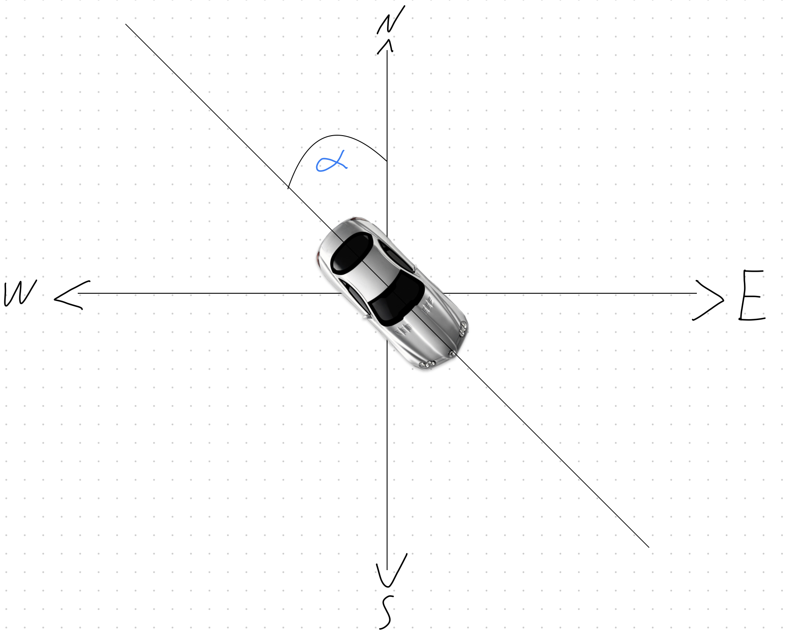
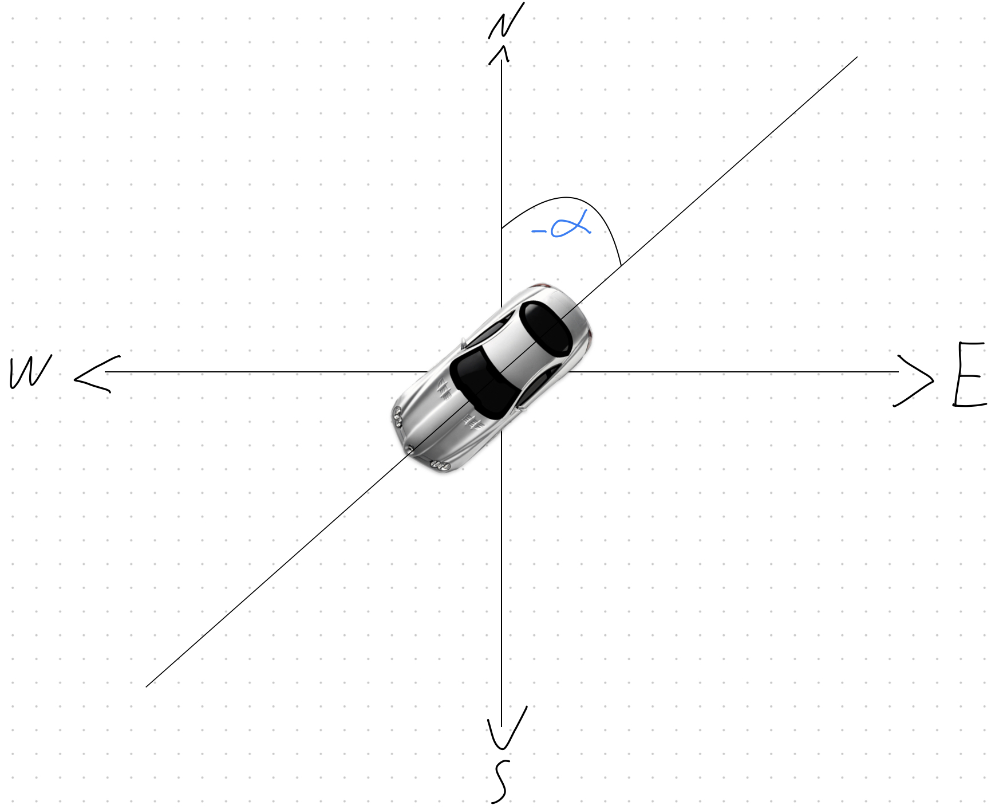
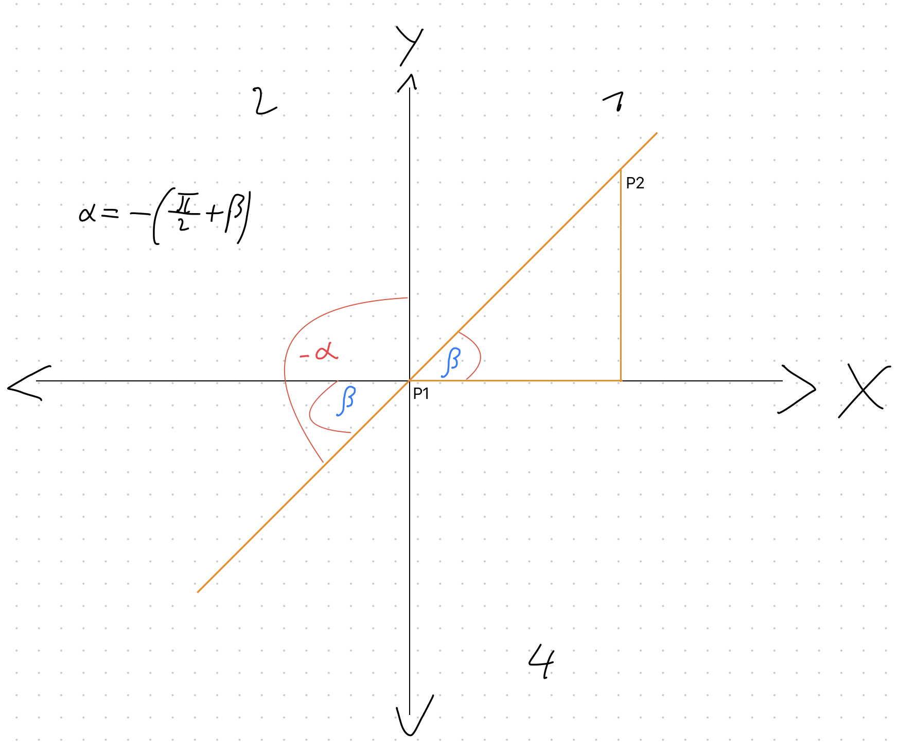
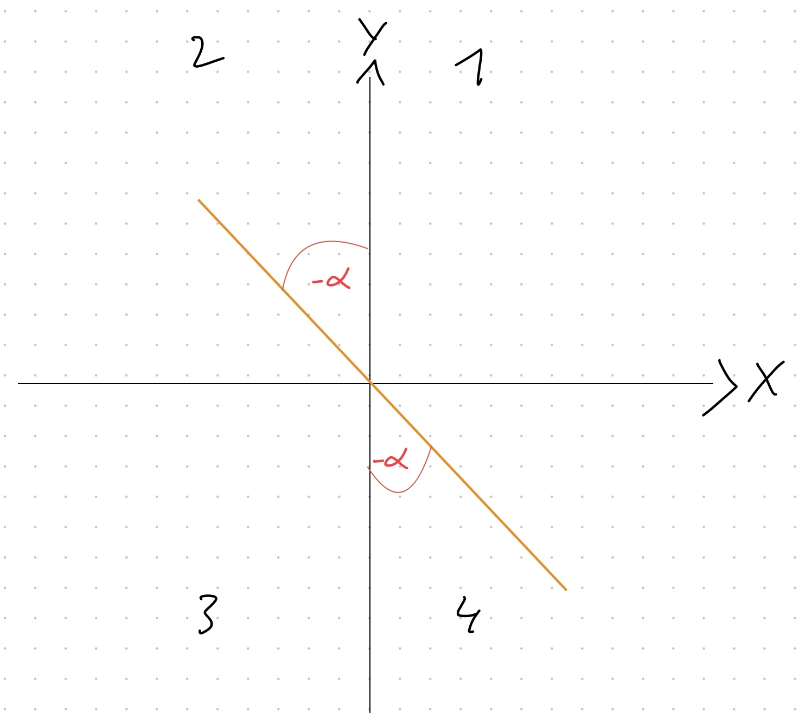

# Calculate Orientation of Detected Vehicles Based on Their Transformed Coordinates

[TOC]

## Approach

The orientation of a vehicle must be provided in the following notation: [x, y, z]. Each parameter represents the rotation of the vehicle around the x, y or z-axis. In our case the map is flat, so we are only interested in the z-axis rotation and must provide the orientation like this: [0, 0, $`\alpha`$]. $`\alpha`$ is the parameter which must be calculated and represents the angle between north and the backside of the car. Is the back of the car pointing straight to north, $`\alpha`$ is 0, pointing to south means $`\alpha`$ is equals $`\pi`$, to east $`-\pi/2`$ and west $`+\pi/2`$ (See figure). So an angle between $`-\pi`$ and $`+\pi`$ must be provided as parameter.

|                Illustration of the angle $`\alpha`$                |                  Illustration of the angle $`-\alpha`$                   |
| :----------------------------------------------------------------: | :----------------------------------------------------------------------: |
|  |  |

## Method

To calculate the angle two coordinates of the vehicle are required: The current point P1(x1, y1) and the next point P2(x2, y2). Also the previous orientation should be provided in case that P2 is equals P1 or P2 doesn't exist.

From the two provided points we construct a triangel where the side is the y-difference and the distance between the two points is the hypotenuse. Following calculation must be done:

- $`hypotenuse=\sqrt{(x_2-x_1)^2+(y_2-y_1)^2}`$
- $`side=|y_2-y_1|`$
- $`q=side/hypotenuse`$

After that it must be checked in which quadrant P2 is to calculate $`\alpha`$.

1. P2 is in quadrant 1: $`\alpha=-(\frac{\pi}{2}+\arcsin(q))`$
2. P2 is in quadrant 2: $`\alpha=\frac{\pi}{2}+\arcsin(q)`$
3. P2 is in quadrant 3: $`\alpha=arccos(q)`$
4. P2 is in quadrant 4: $`\alpha=-arccos(q)`$

The image below shows cases 1 and 4. Case 2 is symmetrical to 1 but $`\alpha`$ is positive. Case 3 is symmetrical to 4 but with positive $`\alpha`$. Note that $`\arcsin(q)`$ is called $`\beta`$ here.

|                       Illustration of the first case                        |                       Illustration of the fourth case                       |
| :-------------------------------------------------------------------------: | :-------------------------------------------------------------------------: |
|  |  |

Note that there are 5 special cases where a triangel can not be constructed:

1. $`x_1=x_2`$ and $`y_1<y_2`$ : $`\alpha=\pi`$
2. $`x_1=x_2`$ and $`y_1>y_2`$ : $`\alpha=0`$
3. $`y_1=y_2`$ and $`x_1<x_2`$ : $`\alpha=-2/\pi`$
4. $`y_1=y_2`$ and $`x_1>x_2`$ : $`\alpha=2/\pi`$
5. $`x_1=x_2`$ and $`y_1=y_2`$ : Use previous direction of the vehicle

## Implementation

- The calculation of the orientation and the generation of the final JSON is in [this script](/calc_orientation/geojson_with_orientation.py).
- As input, a json which with the frames is required. The JSON should look like that:

```
{
    "timestamp": "2022-01-20T20:09:55.000Z",
    "id": [1, 2, 3],
    "coordinates": [[967764.1987389801, 6468677.19386809, 1.0], [967763.8077150271, 6468694.298630416, 1.0], [967733.9523218535, 6468696.157381911, 1.0]],
    "type": ["CAR", "BUS", "CAR"],
}
```

- For calculating the orientation, there is a function called orientation(a, b, prev) which expects the current and next point of the vehicle and its previous position. If there is no next point, use the current point. If there is no previous orientation for a vehicle, use the default position 0.

## Reduction of vehicle wobble

To reduce vehicle wobble, the vehicle will ignore further coordinate updates as long as the new value differs by less than 1 meter from the previous value.

## To run this code

```
    python cleanData.py
```

```
    python ensure_consistent_type.py
```

then run this code

```
    python geojson_with_orientation.py
```

## Persons and Bicycles Orientation Updater

This script processes a JSON file that contains geospatial information about items that cameras have recognized. It adjusts the orientations of entries in the JSON data that have the feature types `PERSON` or `BICYCLE` in that order.

### How It Works

The script performs the following steps:

1. **Loading JSON Data**: Using the `json.load()` function, the script receives JSON data from the file `Camera_12345_cut_final_7500_calculated.json`.

2. **Updating Orientations**: The script determines the characteristics specific to the `PERSON` or `BICYCLE` category for each element in the JSON data. The orientations of these features are then updated to a fixed value of [-1.5, 0, 0].

3. **Saving Updated Data**: Using the `json.dump()` function with an indentation of 4 spaces, the modified JSON data is stored to a new file called `AllCameraMergedWithPersonAndBicycle.json`.


## How to Run

1. **Data Preparation**: Place the `Camera_12345_cut_final_7500_calculated.json` file in the same directory as the script.

2. **Execution**: Open a terminal or command prompt and navigate to the directory containing the script. Then run the script using the command:

   ```bash
   python fixPersonAndBicycle.py
   ```


# Trails Algotithms


# First Approach 

### Velocity Calculation:

The formula for calculating velocity in the x and y directions is derived from the basic physics equation for velocity: velocity = distance / time.
In this case, the code calculates the change in x and y coordinates (dx, dy) between two points and divides them by the time difference to get the velocities (vx, vy).

### Orientation Calculation:

The orientation angle (alpha) is calculated using the arctangent function (np.arctan2). This function returns the angle between the positive x-axis and the line connecting the origin to the point (vx, vy) in the xy-plane.
This angle represents the direction in which the object is moving with respect to the x-axis.


### How to Run the Code:

If you don't have the required libraries installed (numpy).
After that execute the following commands
   ```
    python orientation_transformation_trail_two.py
   ```


## Second Approach

We tried to solve the orientaiton using a python function that performs the conversion of coordinates from the EPSG 3857 coordinate system (also known as Web Mercator) to the WGS 84 coordinate system (latitude and longitude in degrees). The EPSG 3857 coordinate system is commonly used in web mapping applications, while the WGS 84 coordinate system is the standard for representing locations on the Earth's surface.
The conversion is achieved using the pyproj library, which provides powerful geospatial transformation capabilities.


### How to run 
    - You'll need to install the pyproj library before running the code. 
    - Then run this using following commands
   ```
     python orientation_transformation_trail_two.py
   ```
