# Dynamic Team

## Pre-process

### **Objectives:**

1. Upload the city json data into the server.
2. Use the dashboard created by the static team to simulate the dynamic data using widget.

### **Requirements:**

1. City Dynamic data in JSON format.
2. Understand the widget source code and code deployment procedure.
3. Understand the dynamic json data.
4. Read and understand previous semester’s notes for the setup of tools needed.
5. Understanding and Trying Dassault platform tutorials for a better understanding.

### **Equipments:**

**Hardware:**

1. Laptop

**Software:**

1. *Dassault System*
    1. *City Upload Assistant*
    2. *3D Space*
    3. *City Referential*
    4. *City Discover*
    5. *DTN Widget*
2. Gitlab
3. WinScp
4. PUTTY

## Process

### 1. Overview and Workflow:

To understand how the dynamic part of the project works, we will consider the workflow diagram. This section involves simulating dynamic vehicle data (CAR, TRUCK, SUV, VAN, BUS, PERSON, BICYCLE) in JSON format on the Dassault platform and evaluating the simulation. The process consists of three steps.

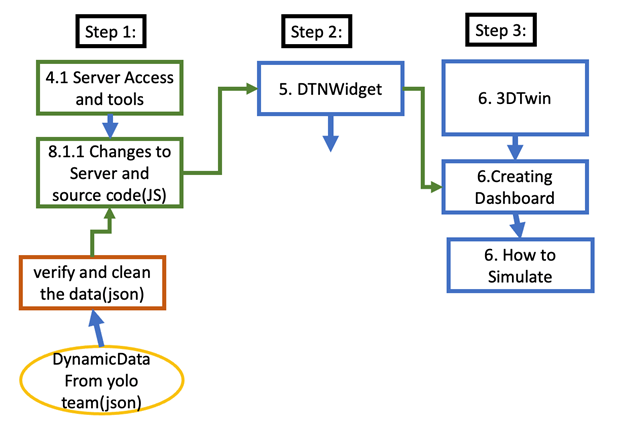

***Step 1:** Data Preparation*

- Obtain dynamic vehicle data in JSON format from the YOLO team. This data file contains the coordinates and orientation of the vehicles from the original video taken by the video team.
- Verify and clean the data by comparing it with previously available JSON data.
- Store or modify the data in our server to connect with the Dassault platform.

***Step 2:** Dassault DTNwidget App*

- Utilize the existing DTNwidget app on the Dassault platform to provide dynamic data to simulate.

***Note:*** We didn't have access to create the DTNwidget app on the dassault platform. As a result we have used the DTNwidget app which was already created in the platform previously and can be found in app section on the platform

***Step 3:** Create 3D-Twin Environment*

- Create a 3D environment (Dashboard) using the Dassault platform to simulate vehicle movement using the dynamic data.
- Use apps/widgets to view the simulation.

***Note:** The widget city discover is an app to view the map of Nibelungenplatz area which was created by the static team.*

### 2. Verify and Clean the Data

The dynamic data JSON file provided by the YOLO team is verified by comparing it with the previous version of JSON data. The data is then processed for uploading, and orientation changes are made for pedestrians and bicycles.

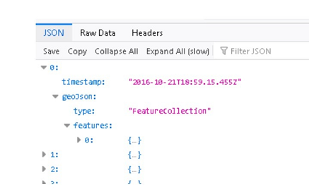

### 3. Problems Encountered

**3.1 Previous Version Challenges (Backlogs)**

- Lack of proper instructions for setting up the process of the netcup server accounts for new users.
- No information on how the widget source code works and how to deploy it on the university server “[https://fra-uas-msc1.de/assets/data](https://fra-uas-msc1.de/assets/data/bicycle.obj)”.
- Dassault's system has limited 3DXC models availability, specifically for bicycles and pedestrians.
- No guidelines on creating new 3DXC models other than the existing ones.
- Difficulties in using the Moulinette tool for 3DXC models.

**3.2 Current Semester Challenges**

- The movement of cars during simulation was not smooth, especially for vehicles going out of the frame.
- Vehicles suddenly disappearing due to detection issues.
- Coordinate boundary calculation not synchronized with City Discover boundary, resulting in vehicles being at the corner of the map.
- No 3DXC models available for pedestrians and bicycles on Dassault platform.
- Vehicles dragging fast when one disappears and merges with the nearest model (data cleaning required).
- Widget code doesn't contribute to the smooth movement of cars, only loads JSON data and combines it with the vehicle model.

### 4. Setup and Configurations

**4.1 Server Access and Tools**

**4.1.1 Server Access**

- The dynamic JSON data is stored on a virtual cloud server accessed using ***netcup VServer*** with the university domain.
- Administrative commands for server access, user management, and file editing are executed using PuTTY.

The following properties of the virtual server we used are given:

- RAM: 2GB
- Storage: 20 GB SSD Hard disk (currently 5Gb is used)
- Network Traffic: 40GB per month
- Hostname: [http://v220211213620170749.ultrasrv.de/](http://v220211213620170749.ultrasrv.de/)
- IP-v4-Address: 202.61.242.46 (currently no IP-v6 enabled)
- Domain: [http://fra-uas-msc1.de/](http://fra-uas-msc1.de/)
- SSL Certificate: Yes
- Servername: SAXSRV00003

For accessing the server as a root-user just [login](https://www.servercontrolpanel.de/SCP/Login) to the server control panel (**https://www.servercontrolpanel.de/SCP/Home**) by entering the SCP credentials which were provided by the previous project owner.

There can also add new users to the sudo group with administrative sudo rights.

For accessing to the server, the following administrative commands should be given:

- New User: sudo adduser username
- Change password: passwd
- Add user to sudo group: *sudo usermod -aG sudo username*
- Check if user has sudo rights: *sudo -l -U username*
- Open file:  *sudo nano /…/…/…*

### 4.1.2 Tools

- ***PuTTY:*** Used for secure file transfer and terminal emulation for server access.
    
    PuTTY Commands for restarting the apache server:
    
    - Enter the credentials to authenticate.
    - Restart Apache2 Server:
        
        ```jsx
        sudo /etc/init.d/apache2 restart
        ```
        
        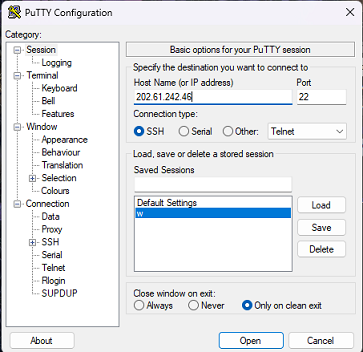
        
    
    
    
- ***WinSCP:*** Used as a GUI for accessing modified files and folders on the server with SFTP support.
    
    For accessing WinSCP with sudo rights we have to configure the following steps:
    
    1. Open WinSCP and set the file protocol as **SFTP.**
    2. Enter the server *hostname* and *port number*.
    3. Put *username* and password for *login*.
        
        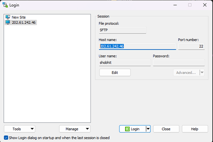
        
    4. Goto advanced settings and change the following parameters under SFTP. Below the **protocol options** the **SFTP server** should be as follows:
        
        ```jsx
        sudo /usr/lib/openssh/sftp-server
        ```
        
        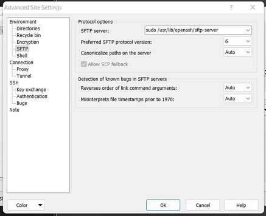
        
        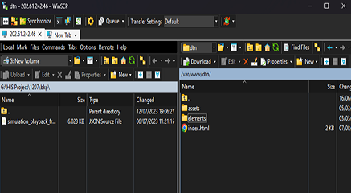
        
- ***DTNWidget:*** A Dassault platform widget used to load dynamic data for simulation. In case no existing widget meets the requirements, a new widget can be created
    
    ***Steps to*** ***Create Widget***
    
    1. Open the Member Control Center in the Platform Management cockpit. (This can only be accessed with administration rights.)
    2. Select 'Create Additional App' in the 4th category Additional apps.
        
        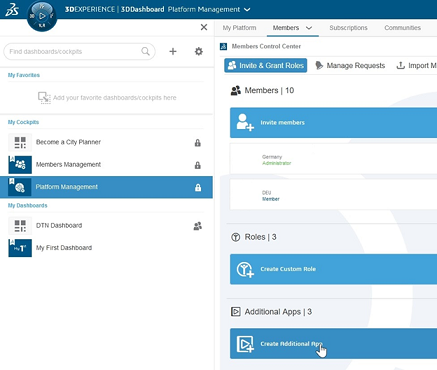
        
    3. A settings window opens. Enter the following information:
        - Name for the widget
        - Select type Widget
        - Specify Source code URL: https://fra-uas-msc1.de.
        - Specify Configuration file URL: https://fra-uas-msc1.de/assets/data/point_cloud_config.json.
            
            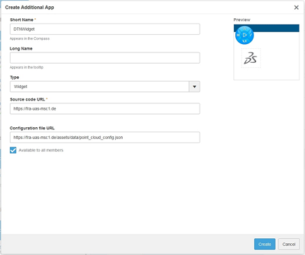
            
        

After the app is successfully created, it can be found in the 'My Apps'-Section and can act together with the City Discover app.

***Note:*** For more information about the source code of the widget and the documentation from Dassault, see the [Point Cloud and Simulation Playback Documentation](https://openness.uwglobe.com/documentation/developer-guides/samples/point-cloud-simulation-playback/). In general, the 3DEXPERIENCity Openness documentation can also be helpful for some other information about the widget.

## 5. 3D-Twin

Before creating the 3D-Twin, city referential with static data and the DTNWidget with dynamic data are imported. The process involves creating a dashboard and adding apps/widgets.

 Follow the steps below to build a 3D twin using the City Discover app and the created widget.

### Step 1: Create Dashboard

You can create an empty dashboard or use a pre-existing template.

To create a new empty dashboard on 3D Experience click on the plus sign (Add Dashboard) on the top right corner of the Dassault platform.  After that you can name the dashboard and / or add  description. 

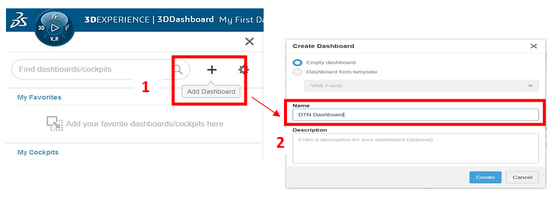

### Step 2: Add Apps to the Dashboard

1. After creating the empty dashboard, add three applications from the left sidebar of "My Apps" by dragging and dropping them into the empty dashboard area.
    
    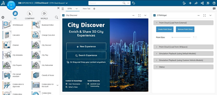
    
2. The apps we use in our dashboard are:
    - The ***City Referential*** is used to upload city-specific static data like buildings, trees, and cameras.
    - The ***City Discover*** app is used to import the static map for a specific location using an EPSG code.
    - ***DTN Widget*** simulates dynamic data and displays the simulation in the City Discover app.
    
    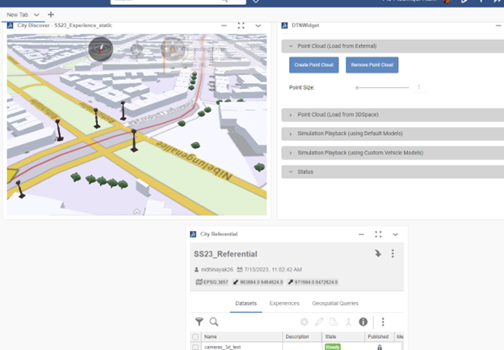
    

### Step 3: Create a New Experience

1. In the City Discover app, click on 'New Experience'.
2. Choose a 'Blank Experience' as a template.
3. Name the experience and select the appropriate referential.

## Step 4: Search for Existing Experience

1. In the City Discover app, click on 'Search Experience'.
2. A window will open where you can select an existing experience that's already built.
    
    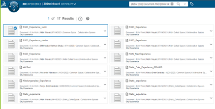
    

### Step 5: City Discover App

1. The app displays a white rectangle in the middle, with sidebars to the left and right.
2. The loaded experience data is shown on the left sidebar, and the data of the selected reference is displayed on the right side.
3. Drag and drop various city datasets onto the map to visualize streets, buildings, and trees.
    
    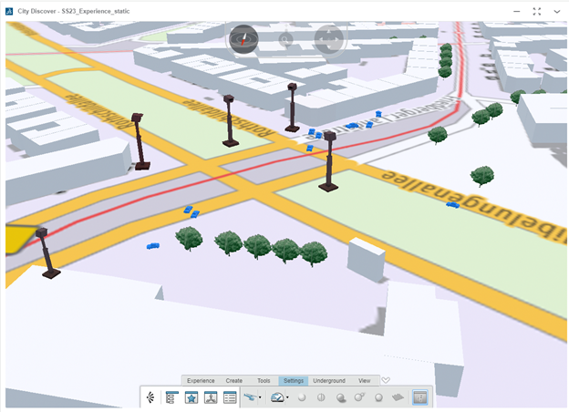
    

### Step 6: DTNWidget

1. After creating a new experience in the City Discover app, load the simulation playback in the DTNWidget.
2. In the generated widget, select 'Simulation Playback (using Custom Vehicle Models)' from the drop-down menu and click the Load button.
3. Adjust the simulation speed as needed.
4. The simulation loading status will be displayed at the bottom of the Status accordion.

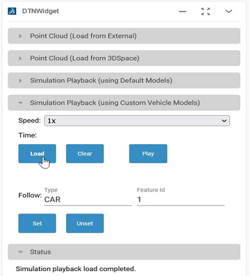

### Step 7: Play Simulation

1. With everything set up, play the simulation by clicking the play button.
2. You will now see the Digital 3D-Twin of the Nibelungenplatz with driving vehicles and dynamic data.
    
    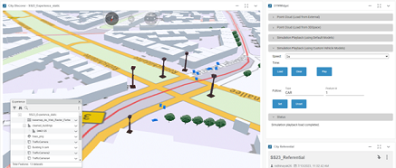
    

These steps should guide you through creating a 3D twin using the City Discover app and the DTNWidget. Have fun exploring your digital twin!

## 6. 3D Models

3D models for pedestrians and bicycles are integrated into the existing model. Attempts to convert the.obj files to .3dxc using Moulinette failed, so the .obj files are used directly which works well on the platform. We upload both the 3D models to our server after obtaining it. The model's path is then included in the server source code changes to the server source code from where the Dassault platform can access the models. Model for pedestrian shown below.

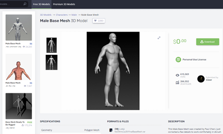

Model forbicycle is shown below.

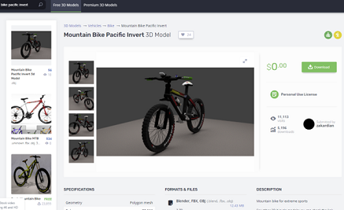

You can find different 3D models here: [https://free3d.com/](https://free3d.com/)

## 7. Result and Discussion

### 7.1 Procedure

### 7.1.1 Changes to the Server and Source Code

- Main JavaScript file information related to 3DXC models, along with their attributes, is deployed at the specified path: “**/var/www/dtn/elements/main-element.js”.**
- Save the file on the **WinSCP** and goto the **PuTTY** terminal to restart the application for the changes to be reflected.
    
    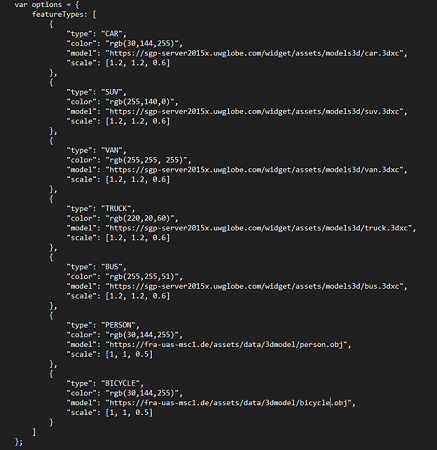
    
- To update the latest JSON file for loading into the widget, replace the existing JSON file **simulation_playback_frankfurt.json** at **/var/www/dtn/assets/data** and restart the application.
- We have created two 3d models and stored in our server at **/var/www/dtn/assets/data/3dmodel [domain access: [https://fra-uas-msc1.de/assets/data/3dmodel/](https://fra-uas-msc1.de/assets/data/3dmodel/)].** Domain address used for referring the model to DTNWidget.
    
    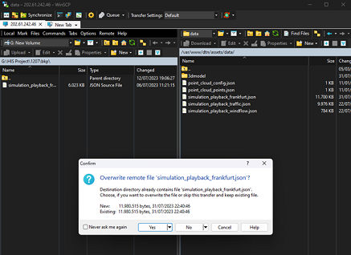
    

### 7.2 Outcome

- Movement of vehicles has improved.
- New 3D models for bicycles and pedestrians are added but require slight modifications in the future.

## 8. Future Enhancements

- Improve orientation for smoother transitions of vehicles.
- Host the 3DXC models folder at a specific path for easy addition and updates.
- Explore additional useful links for further project development. [“https://sgp-server2015x.uwglobe.com/widget/assets/models3d/](https://sgp-server2015x.uwglobe.com/widget/assets/models3d/)”

## 9. Useful Links:

- [Hessische Verwaltung für Bodenmanagement und Geoinformation](https://gds.hessen.de/INTERSHOP/web/WFS/HLBG-Geodaten-Site/de_DE/-/EUR/Default-Start)
- [Perform as a City Referential Manager](https://eduspace.3ds.com/CompanionManager/up/?&lexType=4&lang=en&lpId=914&cls_aud=s&utm_source=77_6_7&utm_medium=onl_lpt&utm_campaign=P914&/index.html/#/lp-content)
- [3DExperience](https://help.3ds.com/2022x/english/dsdoc/FrontmatterMap/DSDocHome.htm?contextscope=cloud&id=493371ee556d4b408d25cc16a2eb79fd)
- [Urban Environment](https://help.3ds.com/2022x/English/DSDoc/FrontmatterMap/dsdoc-r-geovia-VirtualPlanet_City.htm?contextscope=cloud)
- [Source Code](https://openness.uwglobe.com/documentation/developer-guides/samples/point-cloud-simulation-playback/#source-code)
- [Software Download](https://media.3ds.com/support/documentation/developer/R2022x/en/DSDoc.htm?show=CAADocQuickRefs/DSDocHome.htm)