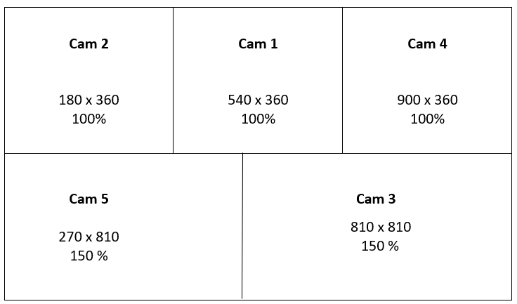
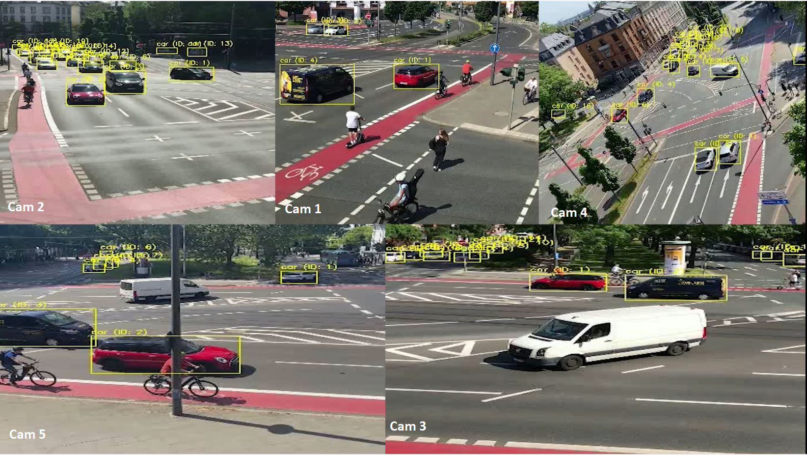

# Merging Videos

## Pre - Merge

### Objectives:

1. Merge on a single video all five video stream
2. Resolution of the video should fit the GDPR 

### Requirements:

1. Videos should be processed by YOLO team
2. Length of videos should be the same

### Equipment:

**Hardware:**

- Laptop

**Software:**

- Adobe Premiere Pro

**Cloud Storage:**

- Magenta Cloud - https://magentacloud.de/s/4pKpf95o5PJntEM?path=%2Fvideo_recordings%2FSS23

## Merge

To achieve the merging of our video clips we need to follow the given steps:

1. Utilize Adobe Premiere Pro to merge the video clips.
2. Insert a new Sequence with the frame size 1080 x 1080 and aspect ratio 1:1 which is similar as our recorded video clips
3. Check once again the resolution of the video clips all of them should have the same resolution
4. Import video clips on our timeline and stack the video clips on top of each other by dragging and dropping on the available video tracks.
5. Make sure the video clips are with the same duration length
6. Check video resolution and fix if needed *Right Click on the video clip* -> *Scale to Frame Size*

Since we have 5 video clips we need to divide the screen into 5 parts. The most important part is o find the anchor position. For each camera it is calculated as given into the image below

The final output is as shown below:

## Post - Merge

1. One video with all  5 video clips in one screen
2. Upload it to Magenta Cloud with the proper labeling
3. We have processed 3 merged videos: 1 final results from YOLO, 1 merged videos for all vehicles and 1 merged video only cars. 

***Notes:***

Since the video clips’s resolution were changed by YOLO team we had to use a 100% scale to fit them properly to our frame size (1080 x1080)
