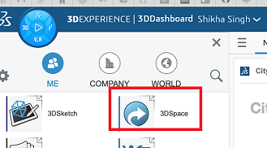

# Static Team

## Pre-process

### *Objectives:*

1. Implement the city data into the map.
2. Make the dashboard ready for dynamic team.

### *Requirements:*

1. City Data
2. Read and understand previous semester’s notes
3. Obtaining the data
4. Understanding Dassault platform

### **Equipments:**

**Hardware:**

1. Laptop

**Software:** 

1. *Dassault System* 
    1. *City Upload Assistant*
    2. *3D Space*
    3. *City Referential*
    4. *City Discover*
2. *Gitlab*

## Process:

Static is data that is stable over time or does not change regularly. Hence it acts as the base for the dynamic team to implement their part. Hence static is important and must be done right from start. Static data contains all that which is permanent on the map like trees, building, roads, tram lines, camera position.

After reading the previous semester notes on Gitlab: *https://gitlab.informatik.fb2.hs-intern.de/kweronek/dtn/-/blob/v3_ws22/docs/README.md*

We have followed the following steps:

1. *Get the map ready*
    1. *Open street map -* 
        
        *Link*  [https://www.openstreetmap.org/export#map=18/50.12985/8.69406&layers=N](https://www.openstreetmap.org/export#map=18/50.12985/8.69406&layers=N)
        
        *Coordinates –*
        xmin : 963694 xmax:971694
        ymin: 6464624 ymax:6472624

        
    2. *Extract the building, tree details –* from previous year data (magentacloud)
    3. *Camera coordinates details -* Exact coordinates of camera were not documented hence adjusted 
    
2. *Store the data extracted from open street map on magenta cloud*
    
    *Link - [https://magentacloud.de/s/dCGbSE7xkGEdfcR?path=%2Fstatic_data%2FWS_22](https://magentacloud.de/s/dCGbSE7xkGEdfcR?path=%2Fstatic_data%2FWS_22)*
    
3. *Understand Dassault systems:*
    1. Educate yourself of the Dassault features – Apps
    2. 3DS Support:
    
    [https://www.3ds.com/support/documentation/](https://www.3ds.com/support/documentation/)
    
    c. *Trainings –*
    
    - *Platform to find tranings -* [https://eduspace.3ds.com/CompanionManager/ui/?ticket=ST-35493369-OQkNf47reqAZ2olNS6jt-cas#/user/catalog](https://eduspace.3ds.com/CompanionManager/ui/?ticket=ST-35493369-OQkNf47reqAZ2olNS6jt-cas#/user/catalog)
    - *Trainings that we went through –*
        
        *[https://eduspace.3ds.com/CompanionManager/up/?&lexType=4&lang=en&lpId=914&cls_aud=s&utm_source=19016_5_33&utm_medium=onl_lpt&utm_campaign=P914&/index.html/#/lp-content](https://eduspace.3ds.com/CompanionManager/up/?&lexType=4&lang=en&lpId=914&cls_aud=s&utm_source=19016_5_33&utm_medium=onl_lpt&utm_campaign=P914&/index.html/#/lp-content)*
        
        - *Practice 3DExperienceCity Essentials*
        - *Practice City Refenetial*
        - *Practice City Discover*.
    
    d.  *Gitlab notes from previous years*
    
4. *Working on Dassault systems*
    1.  *Click on the **Compass → My Apps***
        
        
        
        b. *Click on **Compass → My Apps → City Upload Assistant → Add File***
        
        
        
        c. *Click on **Compass → My Apps → 3D Space*** here you can see all the files that you added using *City Upload Assistant.* 
        
        
        
        d. *Click on **Compass → My Apps → City Referential.***  here you can create a referential with the details as below in the screenshot by selecting a map and entering the map coordinates. At the end you can add adding the files that you need to be displayed as static data.(files from 3d Space or your device)

        

        After adding all the files, you will see the status of it on the left corner. Sometimes their might be transfering error deöete the dataset and try working on it  again. 
        After you add your files here click on settings--> select the necessary settings for each file and click next. Once all the settings are selected you will see the processing stage which might take some time.
        Wait until all of them shows their status as ready.

        
        
        e.  To create a new dashboard ***Compass → My Apps → City Discover → New Experience***
        
        
        
        *Fill in the relevant info, Select the correct Referential that you would like to be displayed in city discover*
        *Once your referential opens up you will see all the files loaded like you can see in the below screenshot*
        A simple drag and drop option also works.
        
        
        
        *After a while of loading you can see the data being displayed. If you want to make any edits to any of the features here (trees, camera etc), you can select the file and then on bar below, select **Tools → Properties.***
        
        Figure below shows, camera being selected.

        

        Once the camera is selected, **click on tools-> Properties -> translation** (you change the postion by changing the offset)**, shape** (change the size of the camers by changing the scale)**, Fill** (Color) etc.

        
        
        In the below experince screenshot you can also notice the difference in the height of the buildings
        
        

        

        **To open our City Experience search for SS23_Experience** 
        

## Post-Process

1. Provide a ready dashboard for Dynamic Team
2. Used City Data to create our dashboard

***Note:*** 

