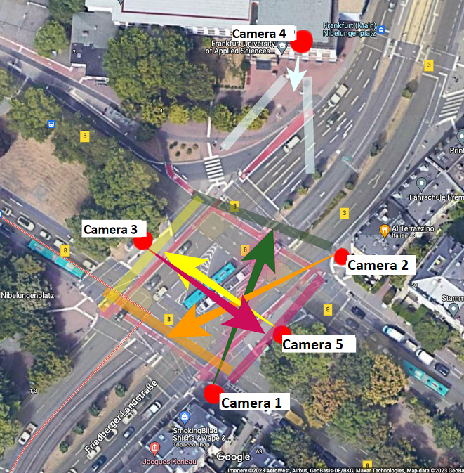

# Video Recording:

## Pre-production

### **Objectives:**

1. Distinguish the requirements and objectives of the video.
2. Select the equipments needed
3. Locate the best video capturing locations

### **Requirements:**

3 sets, each set have 5 video clips at the same time.

Video length should be at least 15 minutes

Configuration:

1. 1 set: Resolution 480X480 || FR : 25
2. 2 set: Resolution 1080 X 1080 || FR : 25
3. 3 set: Resolution 1080 X 1080 || FR : 20
4. Video recording clips from 5 different angles
5. Pedestrians and bicycle should be included in video frame

### **Equipments:**

**Hardware:**

1. 5 cameras (3 iphone - 7, iphone - 11 and iphone  - 12 )
2. 4 tripods on street level and 1 to fix the video on top of the building 9
3. 1 ipad for remote controller 
4. Power banks (2)

**Software:** 

1. [MoviePro - Pro Video Camera](https://apps.apple.com/us/app/moviepro-pro-video-camera/id547101144)
2. [MoviePro Remote](https://apps.apple.com/us/app/moviepro-remote/id1195616020)

**Cloud Storage:**

1. Magenta Cloud - https://magentacloud.de/s/8eqxd7YCeomRsQB?path=%2FSummer%202023

## Production:

### **Testing**

Firstly the video recording team had a basic testing on field video capture activity. There was used one camera and one tripod to fix  locations. During this phase there were identified locations and possible issues which the team should handle during the video capturing activity. At the end, trial videos for positioning were provided.

### Video Capturing:

**Location:**

- The locations were determining during the Testing step by taking trial-videos on different days and from different locations. At the end, five locations as given to the image below were selected to cover the central area of the Nibelungenplatz.

**Camera Operation:**

- Set up and operate video cameras, ensuring proper exposure, focus, and framing for each shot.
- Adjust camera settings

**Lighting:**

- Choose the best lighting period time of the day (no rain, no wind and no clouds) to enhance the visual quality

**Sound:**

- No sound is required for the recordings.

**Equipment and Maintenance:**

- Maintain and organize video equipment, including cameras, tripods, ipad, power banks, phone holders.
- Ensure that all equipmenta are in good working condition.

# Post-Production:

- Provide the recorded footage, following any specific guideline or requirement.
- Review and select the best shots.
