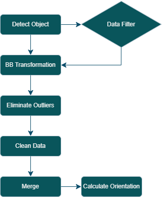
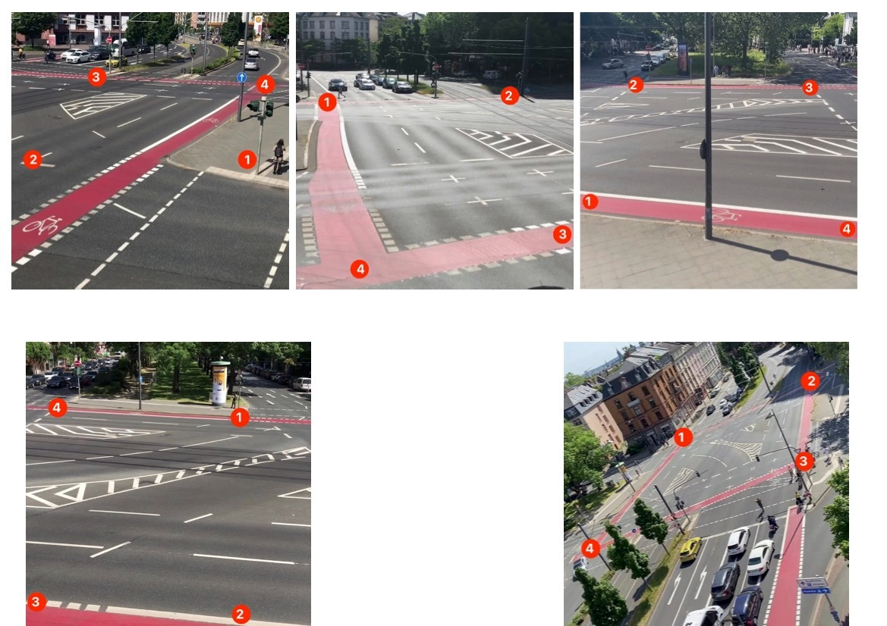
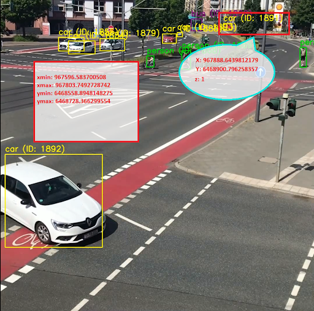
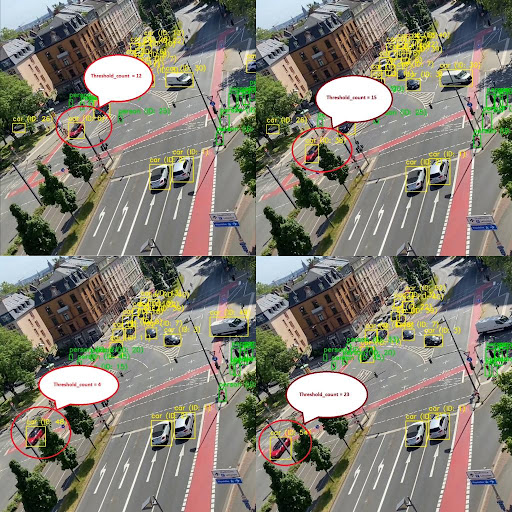
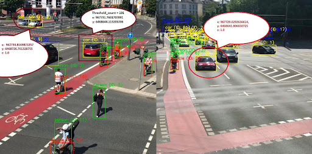
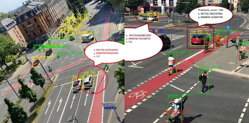
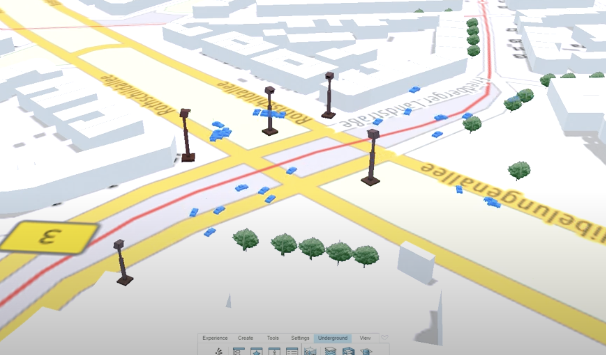
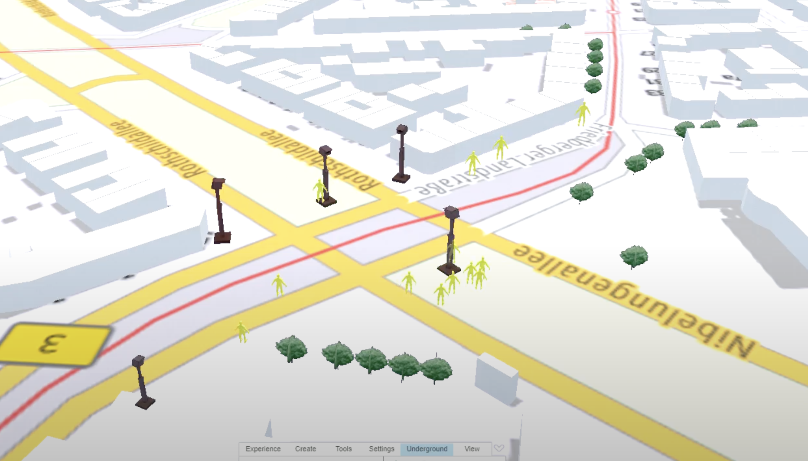
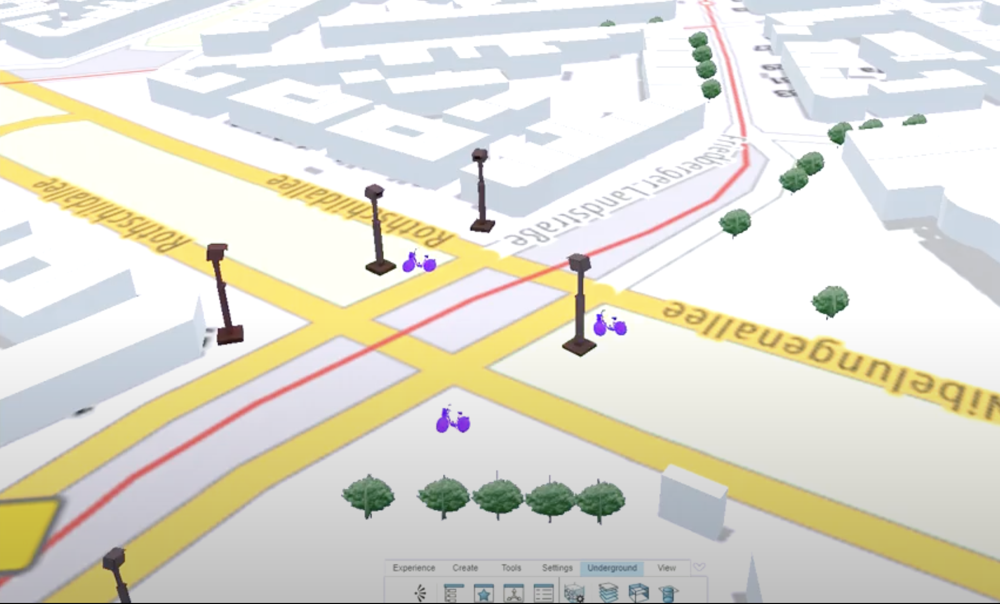
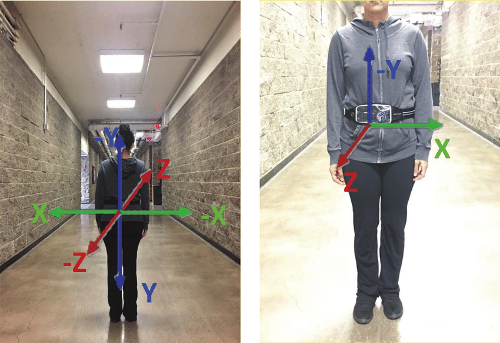

# Project Digital Twin Nibelungenplatz (v4)

## YOLO or YOLOv7

YOLO is an advanced family of object detection architectures and models. The ability to identify objects in a single pass over an input image is the essential concept of YOLO, making it incredibly quick and effective. In contrast to conventional object identification techniques, which include several phases, YOLO instantly predicts bounding boxes and class probabilities for numerous objects.

### 1. Overview and Workflow

  

Figure: Workflow of YOLO section.

### 2. Object Detection using YOLOv7

**Description**

The version of the YOLO object detection model that will be utilized in this project are **YOLOv7** and **SORT**. It is an improved model that builds on YOLOv4.

YOLO (You Only Look Once) is a family of object detection architectures and models. The detections generated by **YOLOv7** are passed to SORT. SORT is a simple implementation of a visual system that tracks multiple objects, which is useful for later trajectory computation in this project. SORT can track any object that the **YOLOv7** model has been trained to detect.

| Input                                                                                                                                                                                | Output                                                                                                                                                                                            |
| ------------------------------------------------------------------------------------------------------------------------------------------------------------------------------------ | ------------------------------------------------------------------------------------------------------------------------------------------------------------------------------------------------- |
| `Video Data`, which are stored in MagentaCLOUD under the folder [`video_recordings`](https://magentacloud.de/s/4pKpf95o5PJntEM?path=%2Fvideo_recordings%2FSS23%2FtrimVideo%2F5mins). | Timestamped `2D Bounding Boxes` in JSON format, which are stored in MagentaCLOUD under the folder [`yolo_v7_output`](https://magentacloud.de/s/4pKpf95o5PJntEM?path=%2Fyolo_v7%2F5MinOutputJson). |

> **NOTE:**
>
> - In version 4, YOLOv7 + SORT is used. We used 2D boxes as version 3 with YOLO latest version. In combination with SORT it offers the possibility of object tracking and thus an advantage for the later trajectory computation.

**Step-by-Step**

For more information about the source code and the use of **YOLOv7** with **SORT** in this project (setup, execution, output, known bugs), see [YOLOv7 README](yolov7/README.md).

### 3. Data Filtering

This script's purpose is to filter particular elements out of a JSON file that contains camera data. The script's main objective is to extract information about a certain type from the input file. The input JSON file is successfully read, the filtering method is used, and then the filtered data is written to a new JSON file.

**Functionality**

- **Input JSON File:** The script takes an input JSON file that contains camera data with various entries.
- **Filtering Criterion:** Based on a predetermined type, the script separates the pertinent entries from the supplied JSON data.
- **Data Extraction:** The script examines the JSON input and extracts just those entries that correspond to the designated type.
- **Filtered Data Output:** After filtering, the script writes the extracted entries, which pertain to the specified type, into a new JSON file.

Using this script, it is possible to effectively extract particular data types from large JSON files that contain camera data. Users can quickly concentrate on and examine specific types of information in the camera stream by using the filtering criterion that is provided. The filtered data is included in the output JSON file, enabling additional analysis and visualization of the relevant camera records.

> **NOTE:**
>
> - We will skip this step if we think we don't need to filter the data from the initial object detection.

**_Filterd Data_**

| Type                    | Link                                                                                                  |
| ----------------------- | ----------------------------------------------------------------------------------------------------- |
| Car                     | [Link](https://magentacloud.de/s/4pKpf95o5PJntEM?path=%2Fdata_filter%2FSS23%2Fcar)                    |
| Person                  | [Link](https://magentacloud.de/s/4pKpf95o5PJntEM?path=%2Fdata_filter%2FSS23%2Fperson)                 |
| Bicycle                 | [Link](https://magentacloud.de/s/4pKpf95o5PJntEM?path=%2Fdata_filter%2FSS23%2Fbicycle)                |
| Car and Bicycle         | [Link](https://magentacloud.de/s/4pKpf95o5PJntEM?path=%2Fdata_filter%2FSS23%2Fcar_and_bicycle)        |
| Car and Person          | [Link](https://magentacloud.de/s/4pKpf95o5PJntEM?path=%2Fdata_filter%2FSS23%2Fcar_and_person)         |
| Car, Bicycle and Person | [Link](https://magentacloud.de/s/4pKpf95o5PJntEM?path=%2Fdata_filter%2FSS23%2Fcar_bicycle_and_person) |

### 4. Transform Coordinates

**Description**

This phase involves converting the 2D Bounding Boxes (2DBB) obtained from the Step [Detect Objects](#1-detect-objects) into EPSG-3857 Geo-Coordinates, which explains the folder name `bb_transformation`. This transformation is achieved by initially calculating the pixel coordinates of the detected vehicles' centroids using the 2DBB's pixel coordinates. Subsequently, these pixel coordinates are converted into EPSG-3857 Geo-Coordinates, relying on predefined reference points to perform the transformation.

Through the use of geometric computations and projection, pixel coordinates are converted to EPSG-3857 Geo-Coordinates. The crucial component in this procedure is the transformation matrix that is created from the reference points. This transformation allows us to precisely geolocate the detected vehicles, enabling various geographic applications like geospatial analysis and visualization and allowing us to examine their positions in context to the real world.

| Input                                                                                                                                                                                                               | Output                                                                                                                                                                                             |
| ------------------------------------------------------------------------------------------------------------------------------------------------------------------------------------------------------------------- | -------------------------------------------------------------------------------------------------------------------------------------------------------------------------------------------------- |
| Timestamped `2D Bounding Boxes` in JSON format, which are stored in MagentaCLOUD under the folder [`bb_transformation_input`](https://magentacloud.de/s/4pKpf95o5PJntEM?path=%2Fbb_transformation%2FSS23%2Finputs). | EPSG-3857 `Geo-Coordinates`, which are stored in MagentaCLOUD under the folder [`bb_transformation_output`](https://magentacloud.de/s/4pKpf95o5PJntEM?path=%2Fbb_transformation%2FSS23%2Foutputs). |

**Step-by-Step**

| Step | Description                                              |
| ---- | -------------------------------------------------------- |
| 1    | Extract reference points from Video Data                 |
| 2    | Transform pixel coordinates to EPSG-3857 Geo-coordinates |

**Step 1: Extract reference points from Video Data**

In order to convert pixel coordinates into EPSG-3857 Geo-Coordinates, a transformation matrix is utilized. This matrix is created using four reference points, which serve as fixed and easily recognizable locations in both the Video Data and Google Maps Satellite View. The image below illustrates these four reference points for each camera used in project DTN4.

Figure: Extract reference points from Video Data.

There are two ways to extract reference points from Video Data:

1. By using QGIS: See [Transformation.md](../bb_transformation/Transformation.md) for detailed instructions.
2. By using Paint (Windows) and Google Maps:

   - Take a screenshot of the video data and then resize it using Paint to match the video data's resolution, such as 1080x1080.
   - On the resized screenshot, place the mouse pointer over the relevant reference point. On Paint's bottom left corner, the pixel coordinates of the chosen reference point are shown.
   - Look for the selected reference point in Google Maps Satellite View. Click on it to get its EPSG-4326 Geo-Coordinates. Convert these coordinates to EPSG-3857 Geo-Coordinates by using [the Transform feature of epsg.io](https://epsg.io/transform#s_srs=4326&t_srs=3857&x=NaN&y=NaN).

The extracted reference points are stored in the file [ref_points.csv](../bb_transformation/ref_points/ref_points.csv).

**Step 2: Transform pixel coordinates to EPSG-3857 Geo-coordinates**

For more information about the implementation of this step, see [BB-Transformation README](../bb_transformation/README.md).

### 5. Remove Outliers

This script processes a GeoJSON file containing location data from a camera feed. Its main objective is to remove data points that are outside of a certain bounding box. The filtered data is then saved to a new GeoJSON file. Some cameras are detecting faraway objects; for example, Building 9's cameras have a lot of outliers, which leads to inconsistent output. In such cases, we remove these outliers.

The simulation model operates within the Dassault platform, which features a defined boundary box. Regrettably, some cameras within this platform are detecting distant objects, which are classified as outliers. This situation leads to irregularities in the output. In such instances, it becomes necessary for us to take action and exclude these detected objects. For instance, consider the provided image, where Car No. 1891's x-coordinate is 967888.6439812179 and its y-coordinate is 6468900.796258357. The boundary box is described as follows: {'xmin': 967596.583700508, 'xmax': 967803.7492728742, 'ymin': 6468558.8948148275, 'ymax': 6468728.366299554}. Clearly, the coordinates of Car No. 1891 fall outside this defined boundary, necessitating the removal of this object from our analysis.

Figure: Detecting Outliers.

| Input                                                                                                                                                                                 | Output                                                                                                                                                                                                                                     |
| ------------------------------------------------------------------------------------------------------------------------------------------------------------------------------------- | ------------------------------------------------------------------------------------------------------------------------------------------------------------------------------------------------------------------------------------------ |
| `Input Data`, which are stored in MagentaCLOUD under the folder [`eliminateOutliers_SS23_input`](https://magentacloud.de/s/4pKpf95o5PJntEM?path=%2FeliminateOutliers%2FSS23%2Finput). | Output of eliminate outliers `eliminateOutliers` in JSON format, which are stored in MagentaCLOUD under the folder [`eliminateOutliers_SS23_output`](https://magentacloud.de/s/4pKpf95o5PJntEM?path=%2FeliminateOutliers%2FSS23%2Foutput). |

**How It Works**

**_**Define Boundaries**_** First of all, we draw box boundaries.

- xmin: 967596.583700508
- xmax: 967803.7492728742
- ymin: 6468558.8948148275
- ymax: 6468728.366299554

**_**Coordinate Filtering:**_**

- we iterate over the array and check if any coordinates do not fall within the boundaries
- Extract coordinates, IDs, and types for each object.

**_**Coordinate Validation:**_**

- Check if each coordinate falls within the specified box boundaries.
- If a coordinate is within the box, keep it and its corresponding ID and type.

[**More specification**](../EliminateOutliers)

### 6. Clean Data

Maintaining consistency with object detection might be difficult in some circumstances. Consider a scenario in which a car suddenly appears from one edge of the area, leading YOLO to identify the car. An unanticipated tree suddenly blocks the car's view as it travels, which is a sudden development. Then, YOLO generates a new identifier for the car when it reemerges after some time. This effect may produce erroneous results, such as a car appearing suddenly in the middle of the road in the visual representation.

Figure: Identifying and Filtering Out Data Below Minimum Threshold.

Illustratively, let's examine Camera 4's scenario: At a specific juncture, a red car is assigned the identification number 6. However, after a span of 12 frames, an unexpected obstacle—a tree—comes into view, diverting attention from the car and leading to a temporary loss of focus. The car then returns to the scene, but this time it has a new identification number. 15 frames in a row make up the brief continuation of this sequence before the car disappears from view once more.

Even if it seems complete, keeping this data could unintentionally introduce inconsistencies during simulation. These inconsistencies could seem like sudden jumps or discontinuities, which might affect the accuracy of the visual representation. To reduce this, it was wisely decided to leave the information about this specific car out of the JSON file. This comprehensive approach makes sure that the visualization is more seamless and coherent, improving the overall output of the simulation in terms of realism.

| Input                                                                                                                                                                     | Output                                                                                                                                                                                                                              |
| ------------------------------------------------------------------------------------------------------------------------------------------------------------------------- | ----------------------------------------------------------------------------------------------------------------------------------------------------------------------------------------------------------------------------------- |
| `Input Data`, which are stored in MagentaCLOUD under the folder [`clean_data_SS23_inputs`](https://magentacloud.de/s/4pKpf95o5PJntEM?path=%2Fclean_data%2FSS23%2Finputs). | Output of clean data `clean_data_SS23_outputs` in JSON format, which are stored in MagentaCLOUD under the folder [`eliminateOutliers_SS23_outputs`](https://magentacloud.de/s/4pKpf95o5PJntEM?path=%2Fclean_data%2FSS23%2Foutputs). |

**How It Works**

We have applied a method based on object persistence to reduce the problem of object inconsistency and enhance trajectory identification. The steps in the procedure are as follows:

- **Threshold Establishment:** A 2-second threshold is chosen as the initial value.
- **Consecutive Persistence Value:** With a frame rate of 25 frames per second, the value for threshold_count is computed to be 2 seconds, or 50 frames.
- **Coordinate Evaluation:** A thorough analysis is done for each set of coordinates. These coordinates are regarded as sturdy and preserved if they hold steady throughout the course of 50 frames. In contrast, if the coordinates do not satisfy this persistence requirement, they are progressively eliminated from consideration together with the associated identification and object type.

[**More specification**](../cleanData)

## 7. Merge Data

In the merge data, combine two pieces of JSON data from various camera feeds based on how close they are to one another spatially. The objective is to locate and combine data points from the second set that correspond to items found in the first set and are closer than a predetermined threshold. After merging the data, a new JSON file is created and stored.

**Algorithms**

- **Calculate Distance Function:** Calculate the Euclidean distance between two 3D coordinates using the `calculate_distance()` method.

Figure: Camera 1 and Camera 2 coordinates.

In the above figure, we have 2 car’s position from Cam1 and Cam2

- **Cam1:** (x1,y1,z1) = (967731.7601707891, 6468644.113205706, 1.0)
- **Cam2:** (x2,y2,z2) =(967729.0292636614, 6468641.806650725, 1.0)

**Plugging these values into the formula:**

distance = √((x1 - x2)^2 + (y1 - y2)^2 + (z1-z2)^2)

**Threshold distance of these 2 positions:**

Threshold_distance ≈ 3.5736060987

Figure: Camera 3 and Camera 4 coordinates.

In the provided illustration, the positions of two cars are captured by Cam1 and Cam4. When we compute the threshold distance between these positions, the value is determined to be 19.8010500065 units. Enhancing the accuracy of data transformation, by obtaining precise points from Google Maps during the transformation process, could potentially reduce this threshold distance. However, due to potential challenges in acquiring precise points from Google Maps, an alternative approach is taken.

We opt to merge the data from the two JSON sources, Cam1 and Cam4, using a fixed threshold distance of 20 meters. This merging process facilitates the identification of matched positions within this predefined distance. It's important to note that if more accurate points are attainable, this threshold distance can be decreased, resulting in a more refined merging process and subsequently yielding more accurate merged data.

| Input                                                                                                                                                                   | Output                                                                                                                                                                                                                            |
| ----------------------------------------------------------------------------------------------------------------------------------------------------------------------- | --------------------------------------------------------------------------------------------------------------------------------------------------------------------------------------------------------------------------------- |
| `Input Data`, which are stored in MagentaCLOUD under the folder [`merge_data_SS23_input`](https://magentacloud.de/s/4pKpf95o5PJntEM?path=%2Fmerge_data%2FSS23%2Finput). | Output of clean data `merge_data_SS23_output` in JSON format, which are stored in MagentaCLOUD under the folder [`eliminateOutliers_SS23_outputs`](https://magentacloud.de/s/4pKpf95o5PJntEM?path=%2Fmerge_data%2FSS23%2Foutput). |

**Merging Data Function**

Two pieces of JSON data (json_data1 and `json_data2`), a distance threshold, and an ID adjustment value (make sure to change the value every time when you merge 2 json files for getting unique id) are passed to the`merge_json_data()` method. In order to create a new dataset (`merged_data`), it analyzes the data to find matching items.

- **Iterations 1:** run the Cam1 as input and Cam2 as output json using adjust_ID = 10000
- **Iterations 2:** run OutputCam12 as input and Cam3 as output json using adjust_ID = 20000
- **Iterations 3:** run OutputCam123 as input and Cam4 as output json using adjust_ID = 30000
- **Iterations 4:** run OutputCam1234 as input and Cam45 as output json using adjust_ID = 40000

When comparing objects from `json_data1` and `json_data2` for potential merging, the function checks two conditions:

1. It ensures that an object from `json_data2` hasn't been matched with any object from `json_data1` yet. This prevents one object from `json_data2` being merged with multiple objects from `json_data1`

2. It checks if the types of objects in `json_data1` and `json_data2` are the same. Only objects with matching types are considered for merging.

**Merging and Saving Function**

Two input files (`json_file1` and `json_file2`) are read by the`merge_and_save_json()` method to read JSON data. The merged data is then saved to an output file after the program iterates through each pair of data entries and uses the `merge_json_data()` function to combine them.

[**More specification**](../MergeAllCameras)

### 8. Calculate Orientation

**Description**

Based on the Geo-Coordinates received from Step [Transform Coordinates](#13-transform-coordinates), the orientation of moving vehicles can be calculated. The orientation serves to make the movement of the vehicles on the Dassault platform smoother.

> **NOTE:**
>
> - For cleaning the input data, run [this script](/calcOrientation/ensure_consistent_type.py). When a vehicle is detected for the first time, the script stores its detected type. Whenever the vehicle is detected again, the script uses the first detected type for that vehicle.
> - In the previous winter of 2022, orientation was introduced exclusively for car.
> - In addition to car, we have also introduced orientation features for pedestrians and bicycles.
> - We have tried to improve the existing orientation algorithm. We did implement two new algorithms, however, it seems the previous algorithm produced more accurate results than ours. So we retain the previous algorithm.

| Input                                                                                                                                                                                      | Output                                                                                                                                                                                            |
| ------------------------------------------------------------------------------------------------------------------------------------------------------------------------------------------ | ------------------------------------------------------------------------------------------------------------------------------------------------------------------------------------------------- |
| EPSG-3857 `Geo-Coordinates`, which are stored in MagentaCLOUD under the folder [`bb_transformation_output`](https://magentacloud.de/s/4pKpf95o5PJntEM?path=%2Fmerge_data%2FSS23%2Foutput). | `Geo-Coordinates & Orientation`, which are stored in MagentaCLOUD under the folder [`calc_orientation_output`](https://magentacloud.de/s/4pKpf95o5PJntEM?path=%2Fcalc_orientation_output%2FSS23). |

**Car orientation**

Figure: Car orientation.

**Pedestrian orientation**

Figure: Pedestrian orientation.

**Bicycle orientation**

Figure: Bicycle orientation.

**How car orientation works:**

The orientation of a vehicle must be provided in the following notation: [x, y, z]. Each parameter represents the rotation of the vehicle around the x, y or z-axis. In our case the map is flat, so we are only interested in the z-axis rotation and must provide the orientation like this: [0, 0, α\alphaα]. α\alphaα is the parameter which must be calculated and represents the angle between north and the backside of the car.

**How pedestrians & bicycles orientation works:**

The goal is to calculate the movement angle of a person using camera detections. Assuming movement occurs mainly along the X-axis, a constant value of [-1.5, 0, 0] is employed. This value represents an orientation change for detected features like 'PERSON' or 'BICYCLE'. This simplifies movement angle calculation, although it's a basic representation compared to real-world movement complexity. The constant [X, Y, Z] = [-1.5, 0, 0] serves to simulate movement along the X-axis.

### Our First Approach

**Velocity Calculation:**

The formula for calculating velocity in the x and y directions is derived from the basic physics equation for velocity: velocity = distance / time.
In this case, the code calculates the change in x and y coordinates (dx, dy) between two points and divides them by the time difference to get the velocities (vx, vy).

**Orientation Calculation:**

The orientation angle (alpha) is calculated using the arctangent function (np.arctan2). This function returns the angle between the positive x-axis and the line connecting the origin to the point (vx, vy) in the xy-plane.
This angle represents the direction in which the object is moving with respect to the x-axis.

[Source Code](../v4_ss23/calcOrientation/orientation_transformation_trail_two.py)

### Our Second Approach

We tried to solve the orientaiton using a python function that performs the conversion of coordinates from the EPSG 3857 coordinate system (also known as Web Mercator) to the WGS 84 coordinate system (latitude and longitude in degrees). The EPSG 3857 coordinate system is commonly used in web mapping applications, while the WGS 84 coordinate system is the standard for representing locations on the Earth's surface.
The conversion is achieved using the pyproj library, which provides powerful geospatial transformation capabilities.

[Source Code](../v4_ss23/calcOrientation/orientation_transformation_trail_one.py)

### Result & Discussion:

The orientation of vehicles, bicycles, or pedestrians was erratic. Particularly on straight roads, cars are expected to maintain a straight (zero-degree) orientation. However, in reality, their orientation fluctuated between 0 degrees and 360 degrees.

For detailed calculation, see [Calculate Orientation README](../calcOrientation/README.md).

### 9. Demonstrate Video

In this program, the OpenCV library will be used to visualize the outcomes of object detection in films. The main goal is to find and identify items in the video frames, then annotate them by marking their locations and classes for better comprehension and analysis. On the other program, this project includes utilizing OpenCV to resize videos to a predetermined resolution or aspect ratio. This step is necessary because the videos were captured without obtaining individuals' consent, and thus, it is crucial to obscure their identities.

[**More specification**](../demonstrateVideo).

### 10. Problem Faced:

**Camera Viewpoint Alignment:**

- Previously, we encountered challenges with varying camera viewpoints, necessitating multiple runs of video analysis using YOLO. We have addressed this issue by implementing a camera viewpoint alignment mechanism. Now, the data from all cameras are consistently aligned, allowing for more efficient and accurate analysis.

**Real-time Visualization Access:**

- To reduce waiting times for visual results from the Dassault Team, we have proposed a practical solution. We recommend granting at least one member access from the Yolo Team to upload files and visualize the results directly in the Dassault system. This ensures quicker access to valuable insights and facilitates timely decision-making.

**Video Recording**

- During video recording, obstacles such as trees and pillars appeared in the video, causing difficulties in achieving precise results.

### 11. Improvement:

**Merged all cameras data:**

- The data from all cameras have been successfully merged into a single dataset. This ensures a comprehensive view of the monitored area and improves the accuracy of vehicle tracking and analysis.

**Outlier data removal:**

- Outliers, which can negatively impact the system's accuracy, have been identified and removed from the dataset. This step ensures that only reliable data is used for analysis and simulations.

**Data cleaning and interpretation:**

- Due to unwanted trees, vehicles identifier is frequently disappearing, and after a few while appearing it again. We delete such kinds of data. Also, the same identifiers are generated in different files, we make it a unique id for each frame by frame.

### 12. Further Improvement:

1. Make efforts to avoid the presence of trees during video recording.
2. Strive to acquire more accurate data points from Google Maps while undergoing the transformation procedure.
3. Focus in enhancing the behavior of vehicle orientations to achieve more accurate and refined results.
